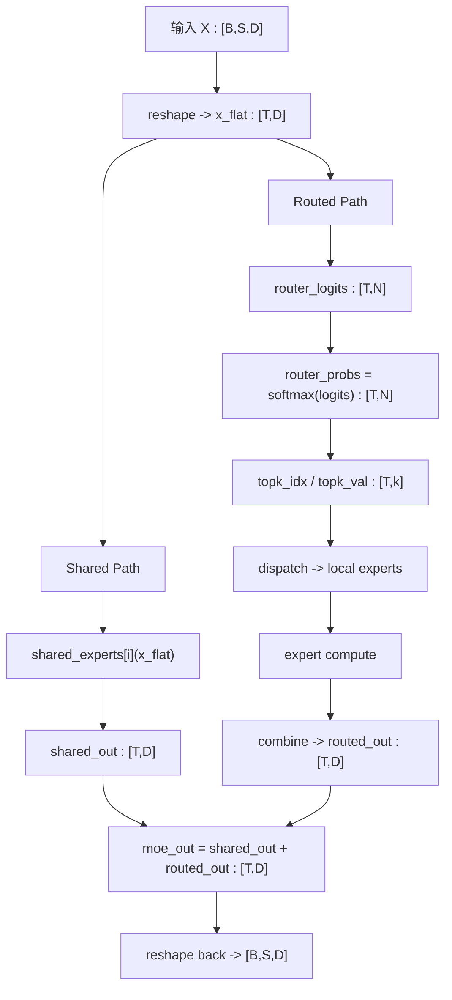

> 一篇从数学、代码到分布式实现的 MoE 技术长文
> 关键词：MoE、Switch Transformer、Mixtral、DeepSeekMoE、DeepSeek-V3、Expert Parallel、All-to-All

## 摘要

Mixture of Experts（MoE）已经成为现代大模型扩展参数规模、控制每 token 计算量、提升训练效率的一条核心技术路线。它的基本思想是：**总参数量随着专家数增长，但每个 token 只激活少数几个专家**，从而让“模型容量”和“单 token 计算量”解耦。自 2017 年 Sparsely-Gated MoE 以来，这条路线逐步发展出 GShard、Switch Transformer、ST-MoE、Mixtral、DeepSeekMoE 和 DeepSeek-V3 等关键变体。它们共同解决了三个核心问题：如何路由、如何平衡负载、以及如何把稀疏路由真正落到大规模分布式系统中。([arXiv][1])

这篇文章尝试把 MoE 从“概念正确”讲到“工程可落地”。我们会从统一数学形式出发，解释为什么专家会分化、为什么训练里一定会出现 aux loss / z-loss / jitter / capacity，然后再把这些概念映射到 Hugging Face Mixtral、DeepSpeed 和 Megatron Core 的真实实现思路上。([GitHub][2])

---

## 1. 为什么需要 MoE

标准稠密 Transformer 的一个硬约束是：**参数量变大，单 token 计算量也几乎一定同步变大**。而在 MoE 中，模型把一层 FFN 替换成多个专家网络，再由 router 对每个 token 只选择少数几个专家参与计算。这样，**总参数量主要和专家总数相关，而激活计算量主要和 top-k 相关**。这正是 Shazeer 2017 所强调的“条件计算”价值：显著提升模型容量，而不会按同样比例增加每步计算。([arXiv][1])

Switch Transformer 则把这个思路进一步简化成 top-1 路由，使训练和系统实现都更直接；ST-MoE 继续解决训练稳定性问题；DeepSeekMoE 和 DeepSeek-V3 则把“专家分化”和“低副作用负载平衡”进一步推向现代 LLM 语境。([机器学习研究杂志][3])

### 一个直观类比

* 稠密 FFN：所有 token 都走同一条“大路”
* MoE：不同 token 被分流到不同“专用子路”

这带来两个收益：

1. 可以在近似固定 FLOPs/token 下继续扩大总参数量。([arXiv][1])
2. 不同 experts 可能学到不同模式，形成 specialization。([arXiv][1])

---

## 2. 一个现代 MoE 层到底在算什么

设展平后的 token 表示为 (x_t \in \mathbb{R}^D)，共有 (N) 个 routed experts。一个标准 top-k MoE 层可以写成：

### 2.1 Router 打分

$$
z_t = W_r x_t \in \mathbb{R}^{N}
$$

### 2.2 Softmax 概率

$$
p_t = \operatorname{softmax}(z_t)
$$

### 2.3 Top-k 选择

$$
S_t = \operatorname{TopK}(p_t, k)
$$

### 2.4 对被选中的 expert 权重重归一化

$$
g_{t,e} =
\frac{p_{t,e}\mathbf{1}[e\in S_t]}
{\sum_{j\in S_t}p_{t,j}}
$$

### 2.5 Routed path 输出

$$
y_t^{\text{routed}} = \sum_{e\in S_t} g_{t,e} E_e(x_t)
$$

这就是 Mixtral 一类现代 token-choice MoE 的主干形式。Hugging Face 的 Mixtral 实现中，也正是沿着“展平 token → router logits → softmax → top-k → top-k 权重重归一化 → expert forward → 聚合”这条路径组织前向。([GitHub][2])

### 2.6 Expert 内部是什么

如果 expert 是普通 FFN，可写成：

$$
E_e(x)=W_{2,e},\sigma(W_{1,e}x)
$$

如果 expert 是更现代的 gated MLP / SwiGLU 风格，则更接近：

$$
E_e(x)=W_{d,e}\big(\phi(W_{g,e}x)\odot (W_{u,e}x)\big)
$$

Mixtral 的 MoE expert 路径属于后一类。([GitHub][2])

---

## 3. DeepSeekMoE：为什么要把 shared experts 单独拿出来

DeepSeekMoE 的一个关键改动，是把 experts 分成两类：

* **shared experts**：所有 token 都经过
* **routed experts**：只对被 router 选中的 token 计算

于是最终输出写成：

$$
y_t
=

\underbrace{\sum_{i=1}^{K_s} E_i^{(s)}(x_t)}*{\text{shared experts}}
+
\underbrace{\sum*{e\in S_t} g_{t,e} E_e^{(r)}(x_t)}_{\text{routed experts}}
$$

这背后的直觉很强：通用知识不应该反复在 routed experts 里被重复学习，shared experts 更适合承载“公共模式”，而 routed experts 更适合承载“细分专长”。DeepSeekMoE 论文正是围绕这件事，提出了 shared expert isolation 与更细粒度 expert segmentation 两条路线。([ACL Anthology][4])

---

## 4. 一个 MoE 层的张量流转图



这里的核心不是张量形状本身，而是你要意识到：

* `shared_out` 是**所有 token**都参与的路径
* `routed_out` 是**只有 top-k experts**参与的路径
* 两条路径最后在 token 维度上对齐并相加

---

## 5. 为什么专家会“分化”出不同能力

MoE 最有意思的地方，不只是稀疏计算，而是 experts 为什么会自然形成 specialization。

如果 expert (e) 的参数是 (\theta_e)，那么它的梯度近似满足：

$$
\nabla_{\theta_e}L
=

\sum_t g_{t,e},\nabla_{\theta_e}\ell_t
$$

这意味着：**一个 expert 主要由被路由到它的 token 更新**。于是不同 experts 实际接触到的是不同的 token 子分布，而不是完全相同的数据分布。随着训练推进，它们自然会分化出不同偏好。Shazeer 2017 观察到了这种趋势，DeepSeekMoE 则把 expert specialization 作为结构设计目标进一步强化。([arXiv][1])

但这里有个关键张力：

* 负载太不均衡，会塌缩到少数 experts
* 负载均衡过强，又会伤害 specialization

这就是为什么后来的研究在不断探索“**如何平衡，但又不要平得太死**”。([arXiv][5])

---

## 6. 训练稳定性的三件套：jitter、aux loss、z-loss

MoE 训练中最常见的三个附加机制，是 jitter、aux loss 和 z-loss。它们经常一起出现，但分工完全不同。

### 6.1 jitter：改输入，不改损失

jitter 的做法是对 router 输入施加一个很小的随机扰动，常见形式是乘法噪声：

$$
\tilde{x}_{t,d}=x_{t,d}\eta_{t,d},
\qquad
\eta_{t,d}\sim\mathcal{U}(1-\varepsilon,1+\varepsilon)
$$

然后 router 实际计算：

$$
z_t = W_r \tilde{x}_t
$$

它的作用是让路由边界不要太僵硬，增加一点探索空间。Megatron Core 把这一项直接暴露为 `moe_input_jitter_eps`，Mixtral 配置里也有对应的 router jitter 参数。([NVIDIA Docs][6])

### 6.2 aux loss：管负载均衡

Switch Transformer 的经典辅助负载均衡损失，定义为：

$$
f_i=\frac{1}{T}\sum_t \mathbf{1}[\operatorname{argmax}(p_t)=i]
$$

$$
P_i=\frac{1}{T}\sum_t p_{t,i}
$$

$$
L_{\text{aux}}=\alpha N\sum_{i=1}^{N} f_iP_i
$$

它直接作为额外项加进总损失，鼓励 experts 的使用分布不要过于偏斜。([机器学习研究杂志][3])

### 6.3 z-loss：管 router logits 的数值尺度

ST-MoE 使用 z-loss 来约束 router logits 的整体幅值：

$$
L_z=\lambda_z\frac{1}{T}\sum_{t=1}^{T}
\left(\log\sum_{e=1}^{N}\exp(z_{t,e})\right)^2
$$

它不直接追求均衡，而是让 softmax / top-k 的数值更稳定。ST-MoE 指出，z-loss 是大规模稀疏模型稳定训练的重要手段。([arXiv][7])

### 6.4 三者并排对照

| 机制       | 改哪里        | 数学对象             | 主要作用            |
| -------- | ---------- | ---------------- | --------------- |
| jitter   | router 输入前 | $x_t$            | 增加探索，减轻早期塌缩     |
| aux loss | 总损失里       | expert 负载分布      | 让 experts 用得更均匀 |
| z-loss   | 总损失里       | router logits 尺度 | 提升数值稳定性         |

---

## 7. capacity 与 token dropping：为什么工程实现离不开它

即使 router 学得很好，也不代表每个 batch 的每一步都会刚好负载均匀。工程上，通常要为每个 expert 设一个 capacity：

$$
C = \max\left(C_{\min}, \left\lceil \alpha \frac{kT}{N} \right\rceil\right)
$$

如果某个 expert 本步收到的 routed assignments 超过 (C)，超出的那部分就会 overflow。于是就出现了熟悉的 `drop_tokens`、`capacity_factor` 等配置。DeepSpeed 的 `sharded_moe.py` 就围绕这一套逻辑组织 gate 与 dispatch。([GitHub][8])

可以把它理解成：**capacity 是把数学上的“任意稀疏路由”，变成工程上“可调度、可控显存、可控通信”的必要约束。**

---

## 8. 从单机代码到分布式 MoE：为什么会有 dispatch / combine

一旦 experts 分布在多张 GPU 上，MoE 的问题就不再只是“选谁”，而变成了：

1. token 被路由到哪个 expert
2. 这个 expert 在哪张卡上
3. token 如何发过去
4. 算完如何发回来
5. 如何按原 token 顺序重新聚合

Megatron Core 的 MoE 文档把这件事总结为：

* **token dispatch**
* **local expert compute**
* **token combine**

这也是我们在教学代码里构造 `send_buffers / recv_buffers / local_slots / return_buffers / routed_out` 那套变量时所模拟的流程。([NVIDIA Docs][6])

### 8.1 Expert Parallel 的映射

设共有 (P) 个 expert-parallel ranks，(N) 个 routed experts，则每个 rank 持有：

$$
N_{\text{local}}=\frac{N}{P}
$$

个 local experts。

全局 expert (e) 对应的 owner rank 与 local expert 编号为：

$$
\text{dst}(e)=\left\lfloor \frac{e}{N_{\text{local}}}\right\rfloor
$$

$$
\text{local}(e)= e \bmod N_{\text{local}}
$$

于是每条 ((t,e)) 路由记录，都要先派发到 (\text{dst}(e))，再进入该 rank 上的第 (\text{local}(e)) 个 local expert batch。([NVIDIA Docs][6])

---

## 9. 分布式数据流可视化


这张图里最关键的是：**数学公式没有变，变的是它被谁算、在哪算、何时发回。**

也就是说，分布式实现不是在改变：

$$
y_t^{\text{routed}} = \sum_{e\in S_t} g_{t,e}E_e(x_t)
$$

而是在改变 **这条式子的执行路径**。

---

## 10. 用代码的眼光看变量流转

如果用工程实现里最常见的变量名来描述，一层 routed MoE 的数据流通常会长这样：

```text
x_flat
 -> router_logits
 -> router_probs
 -> topk_idx / topk_val
 -> dispatch
 -> local expert batches
 -> local expert outputs
 -> weighted outputs
 -> combine
 -> routed_out
```

在 Hugging Face Mixtral 里，这些动作更多是直接写在前向逻辑里；在 DeepSpeed 里，会更显式地变成 `dispatch_mask` 和 `combine_weights`；在 Megatron Core 里，则会进一步和 expert parallel、all-to-all/flex dispatcher、GroupedGEMM 绑定起来。([GitHub][2])

---

## 11. 为什么 DeepSpeed、Mixtral、Megatron 看起来不一样

虽然三套实现的代码风格不同，但本质是在实现同一件事。

### Hugging Face Mixtral

更适合看**数学前向**。你能直接读到展平 token、softmax、top-k、top-k 重归一化、按 expert 收集 token、`index_add_` 回写等关键逻辑。([GitHub][2])

### DeepSpeed

更适合看**路由后的张量语义**。它显式返回 `dispatch_mask`、`combine_weights`、`exp_counts` 等对象，让 dispatch / combine 的逻辑变得更清晰，也更适合接入分布式 token 派发。([GitHub][8])

### Megatron Core

更适合看**完整生产栈**。文档里不只是 top-k 和 loss，还有 expert parallel、dispatcher 类型、GroupedGEMM、fusion、DeepSeek-V3 配置等系统级内容。([NVIDIA Docs][6])

一句话概括就是：

* Mixtral：更像“公式到代码”
* DeepSpeed：更像“路由到张量”
* Megatron：更像“张量到系统”

---

## 12. Aux-loss-free：为什么现在很多人不再满足于传统辅助损失

传统 aux loss 很有效，但也有副作用：它会直接向 router 引入额外梯度，从而可能干扰主任务。Loss-Free Balancing 的思路是：不再显式加 auxiliary loss，而是在路由阶段维护一个动态 expert bias，根据近期负载情况上调冷门 expert、下调热门 expert。这样“平衡”更多是通过**偏置更新**来做，而不是通过额外损失项强行把梯度拉平。([arXiv][5])

DeepSeek-V3 明确采用了辅助损失自由的负载均衡策略，并把它作为减少性能副作用的重要设计之一。([arXiv][9])

---

## 13. 统一总结：现代 MoE 可以压缩成哪条公式

如果只保留最核心的统一表达，我会写成：

$$
y_t
=

\underbrace{\sum_{i=1}^{K_s} E_i^{(s)}(x_t)}*{\text{shared experts}}
+
\underbrace{\sum*{e\in S_t \cap \text{kept}} g_{t,e}E_e^{(r)}(x_t)}_{\text{routed experts}}
$$

其中：

* (S_t)：由 router 的 `softmax + top-k` 给出
* (g_{t,e})：被选 experts 的归一化 gate
* `kept`：表示没有因为 capacity overflow 被 drop 的 routed assignments
* 第二项在真实系统里会被分解成 `dispatch -> local compute -> return -> combine`

这条公式，基本浓缩了当代大部分 LLM-MoE 的共性。([ACL Anthology][4])

---

## 14. 结语

MoE 真正难的地方，从来不只是“用一个线性层做 top-k router”。它难在三件事必须同时成立：

* **数学上合理**：能表达条件计算与专家组合
* **训练上稳定**：不塌缩、不失衡、不数值爆炸
* **系统上跑得动**：dispatch / combine 高效，通信可控，expert batch 可调度

Shazeer 2017 给了稀疏 expert 的原型，Switch Transformer 给了更简单的 top-1 路由，ST-MoE 解决了稳定性问题，DeepSeekMoE 把 shared experts 与 specialization 做成结构设计，DeepSeek-V3 又在负载均衡副作用上继续向前。今天你在代码里看到的每一个 `softmax`、`topk`、`capacity_factor`、`dispatch_mask`、`alltoall`、`expert_bias`，背后都能回收到同一条主线。([arXiv][1])

---

## 参考资料

1. Shazeer et al., *Outrageously Large Neural Networks: The Sparsely-Gated Mixture-of-Experts Layer*. ([arXiv][1])
2. Fedus et al., *Switch Transformers: Scaling to Trillion Parameter Models with Simple and Efficient Sparsity*. ([机器学习研究杂志][3])
3. Zoph et al., *ST-MoE: Designing Stable and Transferable Sparse Expert Models*. ([arXiv][7])
4. Dai et al., *DeepSeekMoE: Towards Ultimate Expert Specialization in Mixture-of-Experts Language Models*. ([ACL Anthology][4])
5. DeepSeek-AI, *DeepSeek-V3 Technical Report*. ([arXiv][9])
6. Hugging Face Transformers, `modeling_mixtral.py`. ([GitHub][2])
7. DeepSpeed, `deepspeed/moe/sharded_moe.py`. ([GitHub][8])
8. NVIDIA Megatron Core, MoE feature guide. ([NVIDIA Docs][6])
9. Wang et al., *Auxiliary-Loss-Free Load Balancing Strategy for Mixture-of-Experts*. ([arXiv][5])

---

下一步最适合做的是把这篇文章落成一份 **可发布 `.md` 文件**，或者补一版 **“读源码导航版”**，把 Mixtral / DeepSpeed / Megatron 的关键函数和阅读顺序列出来。

[1]: https://arxiv.org/abs/1701.06538?utm_source=chatgpt.com "Outrageously Large Neural Networks: The Sparsely-Gated Mixture-of-Experts Layer"
[2]: https://github.com/huggingface/transformers/blob/main/src/transformers/models/mixtral/modeling_mixtral.py?utm_source=chatgpt.com "modeling_mixtral.py - huggingface/transformers"
[3]: https://jmlr.org/papers/v23/21-0998.html?utm_source=chatgpt.com "Switch Transformers: Scaling to Trillion Parameter Models ..."
[4]: https://aclanthology.org/2024.acl-long.70.pdf?utm_source=chatgpt.com "DeepSeekMoE: Towards Ultimate Expert Specialization in ..."
[5]: https://arxiv.org/html/2408.15664v1?utm_source=chatgpt.com "Auxiliary-Loss-Free Load Balancing Strategy for Mixture-of- ..."
[6]: https://docs.nvidia.com/megatron-core/developer-guide/latest/user-guide/features/moe.html?utm_source=chatgpt.com "Mixture of Experts — Megatron Core"
[7]: https://arxiv.org/abs/2202.08906?utm_source=chatgpt.com "ST-MoE: Designing Stable and Transferable Sparse Expert Models"
[8]: https://github.com/microsoft/DeepSpeed/blob/master/deepspeed/moe/sharded_moe.py?utm_source=chatgpt.com "DeepSpeed/deepspeed/moe/sharded_moe.py at master"
[9]: https://arxiv.org/abs/2412.19437?utm_source=chatgpt.com "DeepSeek-V3 Technical Report"

[[MoE代码解读]]
